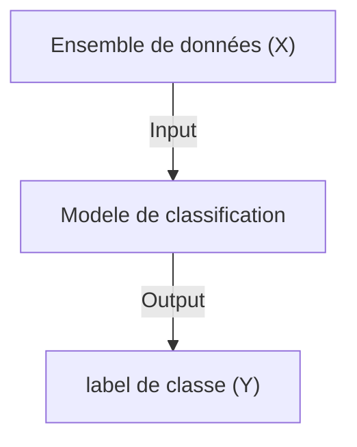
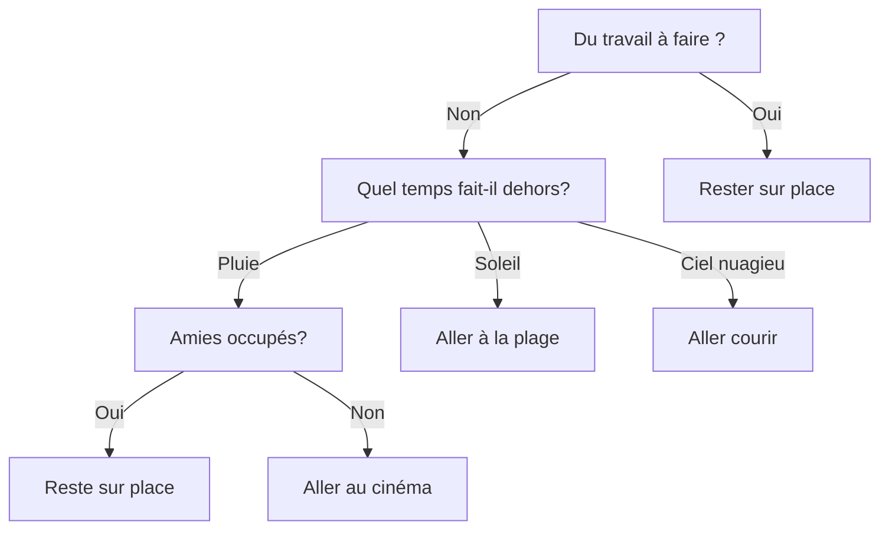

# Classifier d'arbre de decision (iterative)

Ce projet vise à mettre sur pieds une implementation d'un algorithme très frequement utilisé dans le domaine de l'apprentissage artificiel qui est __l'arbre de decision__. Nous envisageons proposer une version totalement iterative du procesus de construction du graphe et de la prediction, ceci sans faire usage d'une bibliothèque de python:


## Generalités sur le algorithmes d'arbre de décision

La classification est un tache qui consiste a associer un object à une catégorie.



**Un arbre de décision** est un algorithme qui permet de former un modèle qui se base sur les arbres de decision pour associer une classe ou un catégorie a une entrée.

Explictement, un arbre classique comporte une racine, des branches et des feuilles. Les arbres de décision en comporte de même. Les conditions qui permettent de séparer au mieux l'ensemble de données est contenu dans les noeuds, les sorties possibles de la condition de séparation sont portées par les branches ou arêtes; et enfin les catégories ou classes sont définies par les feuilles.

Le noeud racine est le parent de tous les noeuds, c'est le noeud le plus haut dans l'arbre. L'arbre de decision permet donc de representer chaque attribut dans les noeuds; les branches definissent les regles de separations et les feuilles definissent les sorties qui peuvent être numériques ou catégorielles.

Nous remarquons donc qu'il s'agit là d'un mimetisme du processus de décision de la vie réelle. Si nous voulons par exemple representer un processus de décision dépendenment des conditions météorologiques, nous pouvons contruire l'arbre suivant



Nous rémarquons cette situation de décision dans la vie réelle peut bien se résumé ou se reproduire en faisant usage d'un arbre de décision.
Lorsque les données n'offrent pas d'avantages lors du fractionnement, l'exécution est directement interrompue. Essayez de trouver un test à la fois plutôt que d'optimiser l'ensemble de l'arbre.

Il existe plusieurs varietés d'algorithmes d'arbre de décision, le tableau si contre vous détails les spécificités de chacune d'elles.

_**Tableau caractérisation des arbres de décision**_

|        __Algorithme d'arbre de décision__         |    __Type de données__    | __Méthode de fractionnement des données numériques__ | __Outils possibles__ |
|:-------------------------------------------------:|:-------------------------:|:----------------------------------------------------:|:--------------------:|
| CHAID (CHi-square Automatic Interaction Detector) |       Catégorielle        |                       Indéfini                       |   SPSS answer tree   |
|          ID3 (Iterative Dichotomiser 3)           |       Catégorielle        |                  Pas de restriction                  |         WEKA         |
|                       C4.5                        | Catégorielle et Numérique |                  Pas de restriction                  |         WEKA         |
|     CART (Classification and Regression Tree)     | Catégorielle et Numérique |                  Séparation binaire                  |       CART 5.0       |

_**Tableau de decription des arbres de décision**_

|                                 __Nom d'Algorithmes__                                 |    __Classification__     |                                                                                     __Description__                                                                                     |
|:-------------------------------------------------------------------------------------:|:-------------------------:|:---------------------------------------------------------------------------------------------------------------------------------------------------------------------------------------:|
|                   CHAID (CHi-square Automatic Interaction Detector)                   |       Antérieur à l'implémentation originale de l'ID3        | Ce type d'arbre de décision est utilisé pour une variable nominale à échelle. La technique détecte la variable dépendante à partir des variables catégorisées d'un ensemble de données. |
|                            ID3 (Iterative Dichotomiser 3)                             |       Utilise la fonction d'entropie et le gain d'information comme mesures.        |              La seule préoccupation concerne les valeurs discrètes. Par conséquent, l'ensemble de données continues doit être classé dans l'ensemble de données discrètes               |
|                                         C4.5                                          |  La version améliorée de l'ID 3 |                                          Traite à la fois des données discrètes et continues. Il peut également gérer les données incomplètes.                                          |
|                       CART (Classification and Regression Tree)                       | Utilise l'indice de Gini comme mesure. |                                                   En appliquant la division numérique, nous pouvons construire l'arbre basé sur CART                                                    |
|                       MARS (multi-adaptive regression splines)                        |Utilisé pour trouver la meilleure répartition.|                                            Pour obtenir la meilleure répartition, nous pouvons utiliser l'arbre de régression basé sur MARS                                             |


En fonction des valeurs de l'attribut de division, les données d'apprentissage sont divisées en plusieurs sous-ensembles. Jusqu'à ce que toutes les instances d'un sous-ensemble appartiennent à la même classe dans n'importe quel arbre de décision, l'algorithme procède de manière récursive.


**Algorithme ID3 (Iterative Dichotomiser 3)**

Entrées :
- dataset: Ensemble de données d'entraînement

- attributes: Liste des attributs de l'ensemble de données

- target_attribute: Attribut cible (classe)

Sortie :
- tree: Arbre de décision résultant

Debut

1. Si tous les exemples de `dataset` appartiennent à la même classe `C`, alors retourner un nœud contenant `C` comme étiquette de classe.
2. Si `attributes` est vide, alors retourner un nœud contenant la classe majoritaire dans `dataset` comme étiquette de classe.
3. Calculer l'attribut `A` de `attributes` qui a le plus grand gain d'information ou la plus petite entropie.
4. Créer un nouveau nœud `node` avec `A` comme attribut de décision.
5. Pour chaque valeur `v` de `A` :
   - Créer un sous-ensemble `sub_dataset` contenant les exemples de `dataset` où l'attribut `A` a la valeur `v`.
   - Si `sub_dataset` est vide, alors créer un nœud feuille avec la classe majoritaire dans `dataset` comme étiquette de classe et l'ajouter comme enfant à `node`.
   - Sinon, récursivement appeler l'algorithme ID3 avec `sub_dataset`, `attributes - A` et `target_attribute`, et ajouter le résultat comme enfant à `node`.
6. Retourner `node` comme nœud de l'arbre de décision.

Fin

Notons que les algoritmes ID3 et C4.5 sont presques similaire dans le fonctionnement.

**Algorithme CART (Classification and Regression Trees)**

Entrées :

- dataset: Ensemble de données d'entraînement

- attributes: Liste des attributs de l'ensemble de données

- target_attribute: Attribut cible (classe ou valeur de régression)

Sortie :

- tree: Arbre de décision résultant

Debut 

1. Si tous les exemples de `dataset` appartiennent à la même classe `C`, alors retourner un nœud contenant `C` comme étiquette de classe.
2. Si `attributes` est vide, alors retourner un nœud contenant la classe majoritaire dans `dataset` comme étiquette de classe.
3. Sélectionner l'attribut `A` et la valeur seuil qui divisent le mieux `dataset` en sous-ensembles purs selon un critère d'impureté (comme l'indice de Gini ou l'entropie).
4. Créer un nouveau nœud `node` avec `A` comme attribut de décision et la valeur seuil.
5. Créer deux sous-ensembles, `sub_dataset1` contenant les exemples où l'attribut `A` est inférieur ou égal à la valeur seuil, et `sub_dataset2` contenant les exemples où l'attribut `A` est supérieur à la valeur seuil.
6. Récursivement appeler l'algorithme CART avec `sub_dataset1`, `attributes`, `target_attribute` et `costs`, et ajouter le résultat comme enfant gauche à `node`.
7. Récursivement appeler l'algorithme CART avec `sub_dataset2`, `attributes`, `target_attribute` et `costs`, et ajouter le résultat comme enfant droit à `node`.
8. Retourner `node` comme nœud de l'arbre de décision.

Fin


Nous proposons une verison qui se base sur l'usage d'une structure de pile pour faciliter le suivi iteratif.
```python
Noeud = {
    
}
```
Noeud = 