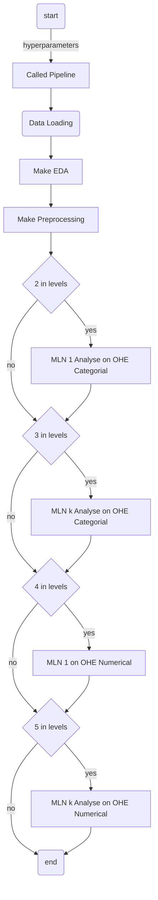

# MultiLayer Networks Analysis (MLNA) Experimentation

## Scripting projet version architecture


    .scripting
    ├── modules/                                 # folder with all pipelines file modules
    │    ├── __init__.py                    	# modules initializer
    │    ├── eda.py                    			# exploratory data analyser module
    │    ├── eda.py                    			# file module
    │    ├── file.py                         	# graph module
    │    ├── graph.py                        	# modeling (training) module
    │    ├── pipeline.py                        # pipeline main logic module
    │    ├── preprocessing.py                   # preprocessing module
    │    ├── report.py                        	# report module
    │    └── test.py                        	# test validator module
    ├── datasets/                                # datasets folder of the application
    │    ├── credit_risk_dataset.csv            # credit risk dataset gave by Dr. Nzekon
    │    └── New_data_first.xlsx                # Afriland First Bank dataset
    ├── CHANGELOG                              	# Track changes on the project
    ├── Makefile                                # make easy the running stage
    ├── mlna_on_afb_dataset.py                  # main executor file for afb MLNA
    ├── mlna_on_credit_risk_dataset.py          # main executor file for credit risk MLNA
    └── analyser.ipynb               			# application UncaughtException log file for enhanced debugging

## How to setup environnement to run this code

this projet is based on python language and is using *Anaconda 2022.05* with *conda 22.09* and *python 3.8*. This means that all packages used in the project has been install within one the following usedfull command:
```bash
conda install -c channel_name name_package

# -c to change the package channel. by default is anaconda
```
or 
```bash
python3.8 -m pip install name_package

# -m to ask to python3.8 to execute an exact specific module as script
```

* So after saying that, the list of required package used in the project are:
	* [x] pandas
	* [x] numpy
	* [x] joblib
	* [x] networkx
	* [x] os
	* [x] sys
	* [x] collections
	* [x] itertools
	* [x] sklearn
	* [x] imblearn
	* [x] IPython
	* [x] plotly
	* [x] matplotlib
	* [x] seaborn
	* [x] imgkit
	* [x] time
	* [x] tqdm
	* [x] importlib

Numerous of these packages are already installed by default. 

There is also a need of make environnement to easy run the code and parallel for parallel execution approach. On Linux or Mac OS
```bash
sudo apt install make parallel
# on linux
```

```bash
brew install make parallel
# on Mac
```

if windows OS, no need but for the running stage, we'll look inside the `Makefile` to get the full command of the the execution and directly in ou CLI

## How to run the code

look inside 
+ the main executor's files and setup hyperparameter of pipeline baese on the description of `./modules/pipeline!L643:662`
+ the  `./modules/pipeline!L393:395` file, uncomment the need one between `combination of variables in range of 2 to len of OHE variables` --> `L395`, `just combination of len 2 of OHE variables`-->`L394` and `combination of len 2 to len of OHE variable + 1`-->`L393`


After that, use the `Makefile` and redefined the number of job to use to run our pipeline in a parallel approach.

Make sure that the `python3.8` in Makefile is the same with your env where all packages has been install

Nexted, open cmd in the folder and just run
```bash
make parallel
``` 


## Pipeline Logic

* [x] List of hyper parameters

```python
{
	# current working directory
	cwd: String,
	# which relate dataset
	domain: String,
	# url, uri, path to the dataset
	dataset_link: String,
	# which is the target variables name in the source dataset
	target_variable: String,
	# dataset delimiter
	dataset_delimiter: {
		type: String,
		default: ','
	},
	# allow to analyse all categorial variables
	all_nominal: {
		type: Boolean,
		default: True
	}
	# if false, list of study categorial attribut
	nominal_list: { # not implement yet
		type: List()<string>,
		default: None
	},
	# allow analyse all numerical variables
	all_numeric: {
		type: Boolean,
		default: True
	},
	# if false, list of study categorial attribut
	numerical_list: { # not implement yet
		type: List()<String>,
		default: None
	},
	# debug trace
	verbose: {
		type: Boolean,
		default: True
	},
	# fix inbalance in data 
	fix_imbalance: {
		type: Boolean,
		default: True
	},
	# which stage will be enter
	levels: {
		type: List()<Number>, # {0,1,2,3,4,5} sont les possibilités
		default: None
	},
	# which variables are not usedfull for analyse
	to_remove: {
		type: List()<String>,
		default: None
	},
	# encoding of dataset
	encoding: {
		type: String,
		default: 'utf-8'
	},
	# la position de l'index dans le dataset
	index_col: {
		type: Number,
		default: None
	}

}
```

* [x] pipeline workflow

