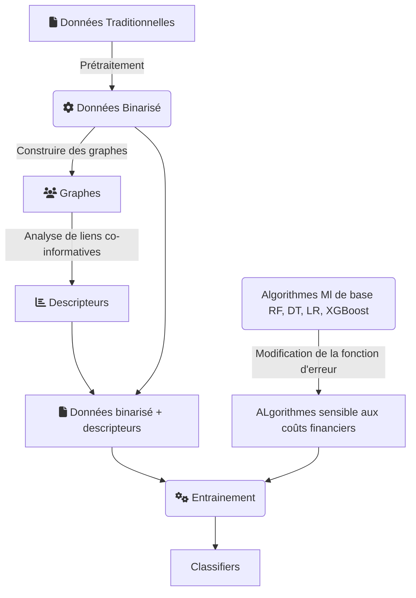

```mermaid
flowchart TD
    A[fa:fa-file Données Traditionnelles] -->|Prétraitement| B(fa:fa-gear Données Binarisé)
    B -->|Construire des graphes| C[fa:fa-users Graphes]
    C -->|Analyse de liens co-informatives| D[fa:fa-bar-chart Descripteurs]
    D -->E[fa:fa-file Données binarisé + descripteurs]
    B -->E
    F(Algorithmes Ml de base RF, DT, LR, XGBoost) -->|Modification de la fonction d'erreur| G[ALgorithmes sensible aux coûts financiers]
    E --> H(fa:fa-cogs Entrainement)
    G --> H
    H --> I[Classifiers]
```
