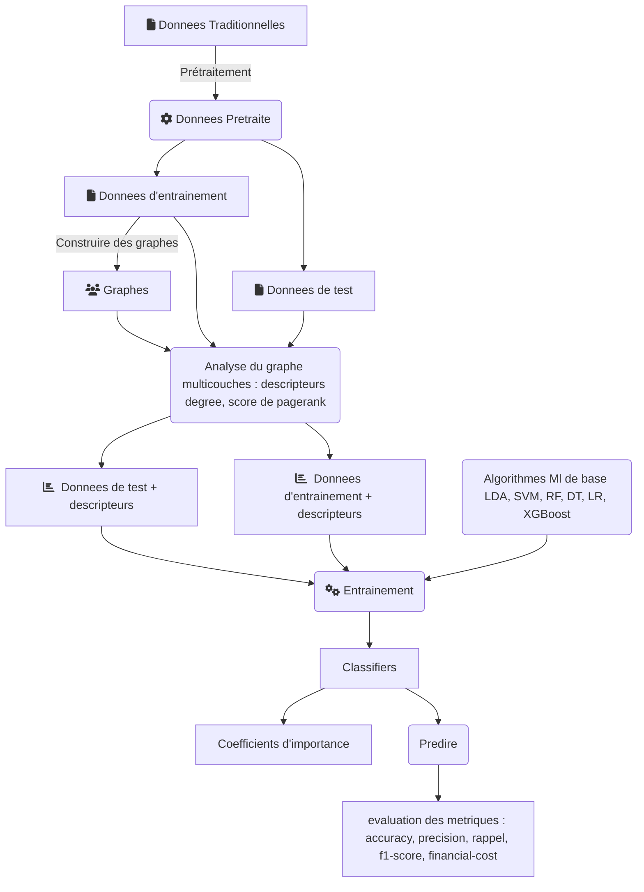

```mermaid
flowchart TD
    A[fa:fa-file Donnees Traditionnelles] -->|Prétraitement| B(fa:fa-gear Donnees Pretraite)
    B --> J[fa:fa-file Donnees d'entrainement]
    B --> K[fa:fa-file Donnees de test]
    J -->|Construire des graphes| C[fa:fa-users Graphes]
    C --> L(Analyse du graphe multicouches : descripteurs degree, score de pagerank)
    J --> L
    K --> L
    L --> D[fa:fa-bar-chart  Donnees d'entrainement + descripteurs]
    L --> G[fa:fa-bar-chart  Donnees de test + descripteurs]
    
    G --> H(fa:fa-cogs Entrainement)
    D --> H
    F(Algorithmes Ml de base LDA, SVM, RF, DT, LR, XGBoost) -->H
    H --> I[Classifiers]
    I --> N[Coefficients d'importance]
    I --> O(Predire)
    O --> M[evaluation des metriques : accuracy, precision, rappel, f1-score, financial-cost]
```
